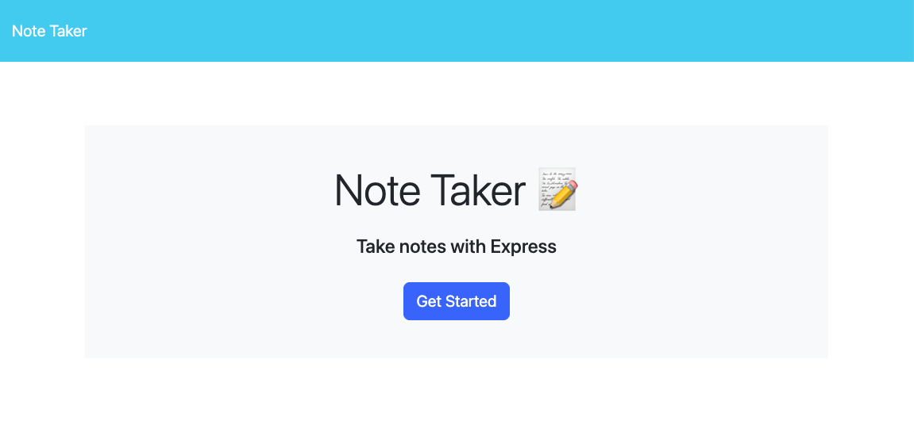
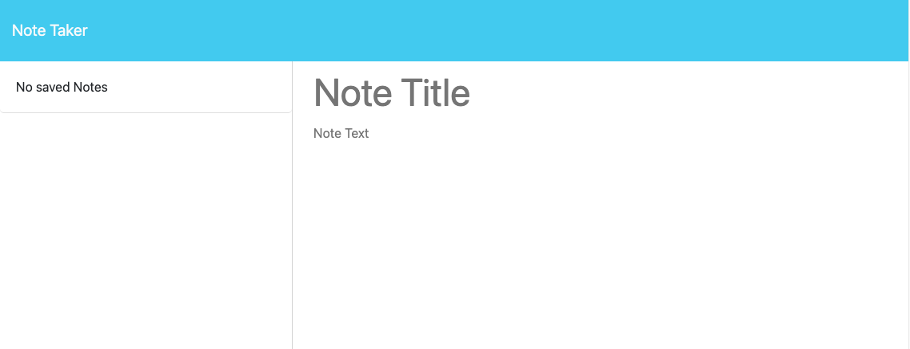
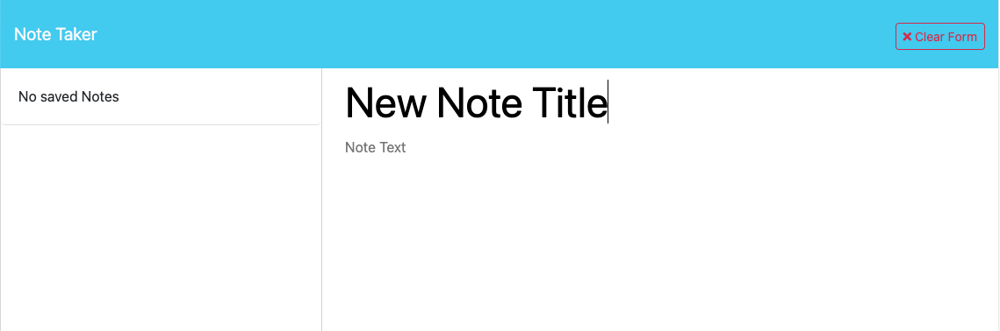
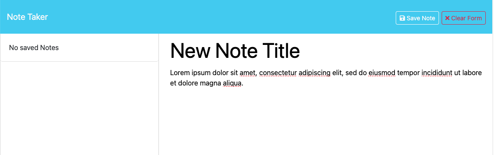
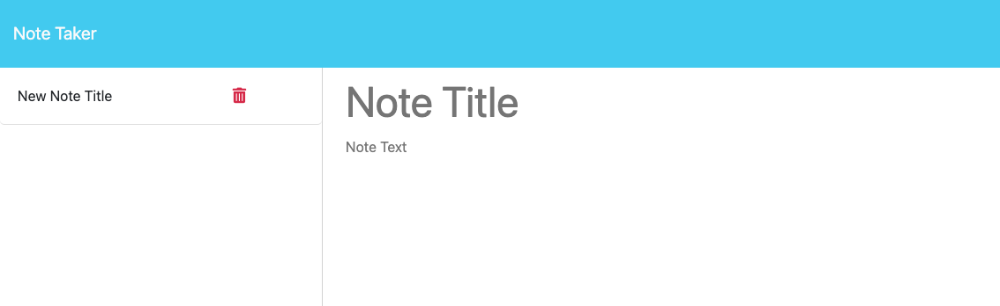
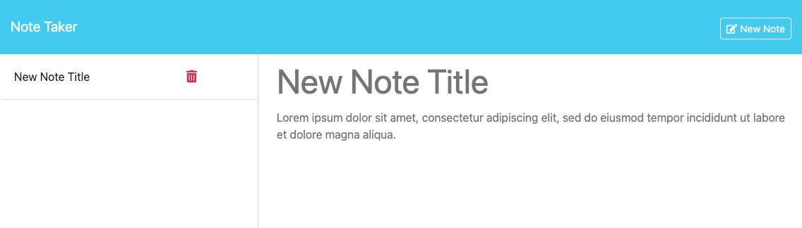

# Note Taker

## Description 

For this project, I was tasked to create the backend for an application called Note Taker that can be used to write and save notes. It required an [Express.js](https://expressjs.com/) backend to save and retrieve notes from a JSON file. I had to build the backend, connect the two, and then deploy the entire application to [Heroku](https://www.heroku.com/).

This project gave me the opportunity to better understand the primary types of fetch requests, including get, post, and delete. Although it wasn't necessary, I implemented modular routing to learn better how to set it up and to make future expansion of the app simpler. I also had to ensure that added elements were provided with a unique id so that they could be referenced by the application for display and if necessary for deletion, so I learned about and employed [uuid](https://www.npmjs.com/package/uuid) for that purpose.

I deployed the application on Heroku, and it can be found [here]().


## Installation

N/A


## Usage 

When the application is loaded, the user is presented a welcome page. Any address at the root page location will result in a wildcard route leading to the ```index.html``` page. If the user clicks the **Get Started** button, they will be taken to the ```notes.html``` page.



On the ```notes.html``` page, the user will be presented with a left column holding saved notes, and a right column with entry fields for **Note Title** and **Note Text**. If the user has not saved any notes, the left column will be empty with the message **No saved Notes**.



When the user begins entering data in the Title or Text fields, a **Clear Form** button will appear in the nav bar.



Once text is entered into both fields, a second button, **Save Note**, will also appear.



Clicking the **Clear Form** button will empty the input fields. Clicking on **Save Note** will save the note to the server via Express.js and add the note title to the note list in the left column. The note title will have a delete icon button next to it. Additionally, the input fields will be cleared, and the two buttons in the nav bar will disappear.



If the user clicks on the note title in the left column, the title and text of the note will be displayed in read-only format in the right column. Additionally, a **New Note** button will appear in the nav bar.



If the user clicks on the **New Note** button, the note text will be replaced with the entry fields, and the **New Note** button will disappear.

If the user clicks on the note's delete icon button, the saved note will be deleted from the server via Express.js, and the note will be removed from the list of saved notes in the left column.

Saved notes will persist on page reloads, as they are saved on the server. Local storage is not used for this application.


## Credits

I used [express](https://www.npmjs.com/package/express) to route fetch requests to the server.

I used the [node: fs](https://nodejs.org/docs/latest-v18.x/api/fs.html#file-system) module for reading and writing to files.

I used the [node: path](https://nodejs.org/docs/latest-v18.x/api/path.html#path) module for building file and directory paths.

I used [uuid](https://www.npmjs.com/package/uuid) to create unique id tags for each note element.

For the file system utilities, I found ideas in a previous class mini-project on adding routes to an existing application.


## License

Please refer to the LICENSE in the repo.

---